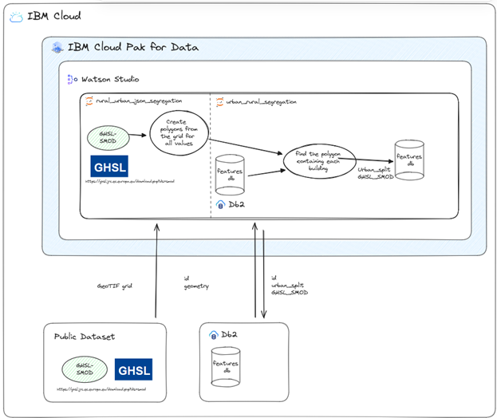
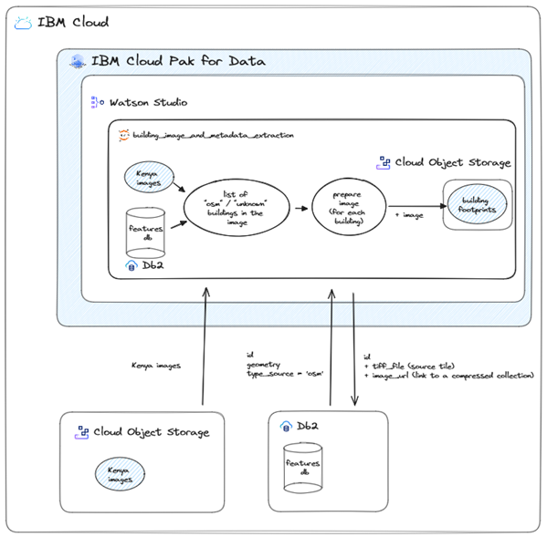
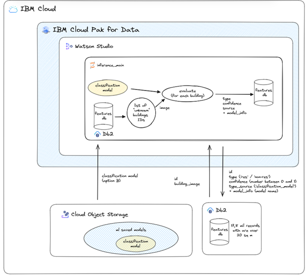

# Data Preprocessing and Inference

## Overview

Open Building Insights's objective is to produce high-quality building footprint datasets, by leveraging publicly available datasets, machine learning and geospatial analytics. The building footprints are obtained from Google-Microsoft Open Buildings (combined and published by [VIDA](https://source.coop/vida/google-microsoft-open-buildings)) and merged with select buildings from OpenStreet Maps. The building footprint catalog is further enriched by other data from public sources to provide fine grained information on the building level.

This section outlines the required data pre-processing steps in order to generate the building footprint dataset. The associated notebooks containing the code are listed in section [Notebooks](#notebooks).

## 1.	Vida data preprocessing 

The publicly available [Google-Microsoft Open Buildings (VIDA)](https://source.coop/vida/google-microsoft-open-buildings) contains building footprints that are available both globally and by country in various formats. The dataset contains a polygon defining the building's footprint on the ground, a confidence score indicating certainity of it being a building, and the respective source (either Google or Microsoft). 

In our approach, the data was accessed in **GeoParquet** format using one of two methods: 
  1. **By country using s2 partitions (India)**: In this approach, all S2 partition files available for the target country are first identified from the VIDA country partition directory (published as GeoParquet partitions by S2 grid). Each partition filename is parsed into an ``S2 cell ID``, and the ID is converted into a geographic point by computing the centroid coordinates (lat/lon). The S2 points are then spatially filtered against a buffered area of interest (AOI) and the correspoding files downloaded. The selected S2 IDs are used to extract buildings from the downloaded partitions.
  
  2. **By country as a single file (Kenya)**: For Kenya, the data is downloaded as a single country-level GeoParquet file. This approach is used because the relevant S2 cells cover a much larger extent and their centroid coordinates fall outside the country boundaries.

  After download, the buildings are filtered using a minimum confidence threshold of **0.7**. In addition to ``geometry``, ``footprint source``, and ``confidence``, the following attributes were computed from each footprint polygon:

    - Area in meters
    - Perimeter in meters 
    - Number of building faces

## 2.	Building height calculation

Google's [Open Buildings 2.5D Temporal Dataset] (https://sites.research.google/gr/open-buildings/temporal/) is used for height calculation. 

## Urban/Rural Classification

Global Human Settlement Layer provides a publicly available data layer named Settlement Model grid, which is used to classify buildings into Urban/Suburban/Rural categories based on their location as well as associating the original SMOD provided category to the building as well. 
A diagram of the urban/rural classification process is shown in [Figure 5](#urban_rural_split).
This layer, represented by a black and white image of a country provides a categorization of each 1x1 km large grid cell as a pixel.
Each building is classified based on which grid cell its centroid belongs to. Additionally, the grid is represented as an overlay in the map in our website to provide a simple guideline for end users.

<figure>
  
  <figcaption>Figure 5: urban/rural classification</a></figcaption>
</figure>

## Building Image and Metadata Extraction

The 110x110 km large tile images are loaded from the cloud object storage and processed with the building information from the ``features_db`` database. 
For each building in features_db, the corresponding building image is cropped from the Kenya images and added to a dedicated bucket in Cloud Object Storage. 
A link to the location, where it is stored in the cloud bucket. 
To optimize I/O bandwidth of the cloud bucket each building image cropped from the same Sentinel-2 tile is stored in the same collection, compressed to provide efficient access to each image for a given tile. 
This choice is efficient as the entire processing process is based on a tile-by-tile processing of buildings, so each building image can be loaded to memory with one I/O request. 
The process is depicted in  [Figure 6](#building_image).

<figure>
  
  <figcaption>Figure 6: building image and metadata extraction</a></figcaption>
</figure>

## ML Inferencing

Tagged buildings from OSM are used in conjunction with their Sentinel images to train a model enabling the categorization of each building from ``features_db`` (detailed in <a href="../machine_learning/README.md">Machine Learning Model</a>).
The Machine Learning inference process consists of evaluating each building in ``features_db``, which is not tagged in OSM, using the pre-trained classification model (see [Figure 7](#building_inference)).
For each evaluated building, the fields ``type`` and ``type_source`` are updated to ``res`` / ``non-res`` and ``classification_model``, respectively.
Furthermore, the model information (``model_info``) and confidence level of the inference between 0 and 1 (``confidence``) are added to the building information. A sketch of the updated ``features_db`` database is depicted in [Figure 1](#features_db).

<figure>
  
  <figcaption>Figure 7: Diagram of the ML inference process. The pre-trained model is used to classify buildings of unknown type. A confidence level is then added to the inferenced building type. </a></figcaption>
</figure>

## Future Improvements

- Automate VIDA data download process, such that a new version is always on the cloud, currently executed on demand

## Associated Risk

To provide classified buildings for any given country two datasets are used, namely a building catalogue (named VIDA) and satellite images to obtain the building footprints/roof images (using Sentinel2 provided images). These images are used to classify the buildings into residential and non-residential buildings from the building catalogue. In cases the building catalogue is substantially newer, than the satellite images, several buildings might be newly constructed and included in the database, while the sentinel images might contain images of constructions of even pre-construction imagery for these areas. This provides incorrect roof image for newly constructed buildings, causing incorrect classification is them by the model.

This risk has a medium impact and its mitigation is handled by the technical team.

**Solution:** The solution to mitigate this risk is to obtain the most recent Sentinel2 images after each update of the VIDA dataset to have the most recent building images for each building from the catalogue.

The cost to resolve/mitigate this problem is to obtain the newest possible Sentinel2 images after any update of the VIDA database, which is a lengthy and resource consuming process.

## Implementation Details

The list of most important libraries is provided:

| Package Name | Version | Short Description |
| --- | --- | --- |
| getpass | 1.0.2 | Portable password input |
| jaydebeapi | 1.2.3 | Use JDBC database drivers from Python 2/3 or Jython with a DB-API. |
| jpype | 1.4.1 | A Python to Java bridge. |
| json | default | A library to work with JSON documents. |
| geopandas | 1.0.1 | Geographic pandas extensions |
| pandas | 1.5.3 | Powerful data structures for data analysis, time series, and statistics |
| pyproj | 3.6.1 | Python interface to PROJ (cartographic projections and coordinate transformations library) |
| shapely | 2.0.5 | Manipulation and analysis of geometric objects |
| numpy | 1.23.5 | Fundamental package for array computing in Python |
| requests | 2.31.0 | Python HTTP for Humans. |
| PIL | 10.4.0 | Python Imaging Library |
| ibm_boto3 |  | The IBM SDK for Python |
| botocore | 1.27.59 | Low-level, data-driven core of boto 3. |
| ibm_cloud_sdk_core | 3.20.3 | Core library used by SDKs for IBM Cloud Services |
| threading | default | Standard threading module |
| rasterio | 1.3.10 | Fast and direct raster I/O for use with Numpy and SciPy |
| tensorflow | 2.17.0 | TensorFlow is an open source machine learning framework for everyone |
| Keras | 3.4.1 | Deep Learning for Humans |
| rioxarray | 0.17.0 | geospatial xarray extension powered by rasterio |
| scikit-image | 0.24.0 | Image processing in Python |
| mgrs | 1.5.0 | MGRS coordinate conversion for Python |
| matplotlib | 3.9.1 | Python plotting package |
| urllib | 2.2.2 | HTTP library with thread-safe connection pooling, file post, and more. |
| scipy | 1.14.0 | Fundamental algorithms for scientific computing in Python |
| scikit-learn | 1.5.1 | A set of python modules for machine learning and data mining |

##Execution Details

To execute the data curation process the following notebooks are executed in order:
1.	1_download_VIDA_datasets.ipynb
2.	2_spatial_grid_generation.ipynb
3.	3_filter_and_extract_buildings_from_VIDA.ipynb
4.	4_match_buildings.ipynb
5.	5_DB2_data_ingestion_from_parquet.ipynb
6.	6_ovarlapping_removal.ipynb
7.	7_building_height_calculation.ipynb
8.	8_rural_urban_json_segregation.ipynb
9.	9_urban_rural_segregation.ipynb
10.	10_S2_TIF_collection.ipynb
11.	11_building_image_and_metadata_extraction.ipynb 
12.	12_inference_main.ipynb

