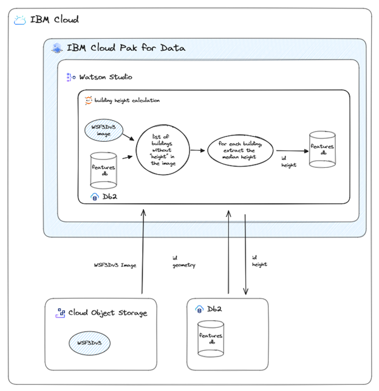
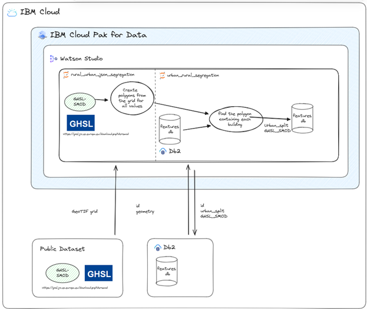

# Data Preprocessing and Inference

## Overview

Open Building Insights's objective is to produce high-quality building footprint datasets, namely a refined settlement data layer, by leveraging machine learning.
The building footprints in the resulting data set are then classified according to a priority tree shown <a href="../machine_learning/README.md#classification_tree">here</a>.
In this section, we present the required data pre-processing and inference steps in order to generate this building footprint dataset.
The pipeline is based on processing two data sets, namely [Sentinel-2](https://sentinel.esa.int/web/sentinel/missions/sentinel-2) Satellite images of Kenya and publicly available [Google-Microsoft Open Buildings (VIDA)](https://beta.source.coop/repositories/vida/google-microsoft-open-buildings/description/) data, combined by VIDA.

To further enrich the building footprint catalog additional sources are ingested to associate additional attributes to buildings.

The following sections describe the data pre-processing part of the <a href="../README.md#data_flow">data flow diagram</a>. The associated notebooks containing the code are listed in section [Notebooks](#notebooks).

## Data Gathering

The objective is to generate a high-quality dataset containing building classifications for a certain geography. 
This is achieved by combining [Sentinel-2](https://sentinel.esa.int/web/sentinel/missions/sentinel-2) satellite images with [Google-Microsoft Open Buildings (VIDA)](https://beta.source.coop/repositories/vida/google-microsoft-open-buildings/description/) data, , which contains a building catalog for a given region without providing auxiliary information.
Therefore all buildings available in the VIDA building catalog are categorized using a machine learning model built based on the [Open Streep Map (OSM)](https://www.openstreetmap.org/) data with building classification (i.e. buildings that are tagged).

The following two datasources are used:

- [Sentinel-2](https://sentinel.esa.int/web/sentinel/missions/sentinel-2) satellite images of Kenya downloaded from the public S3 bucket containing [Sentinel-2 Cloud-Optimized GeoTIFFs](https://registry.opendata.aws/sentinel-2-l2a-cogs/) using the tile system defined in this data source.
- WSF3DV3 data layer provided by the [German Aerospace Center (DLR)](https://www.dlr.de/en/) to utilize in the building height calculation process.
- Publicly available [Google-Microsoft Open Buildings (VIDA)](https://beta.source.coop/repositories/vida/google-microsoft-open-buildings/description/) data, which consists of a list of buildings with specific coordinates and polygons (i.e. shapes of the buildings). The data is downloaded manually as geoparquet files and saved on the cloud.
- Publicly available [GHS Settlement Model grid](https://ghsl.jrc.ec.europa.eu/download.php?ds=smod) downloaded as GeoTIF to categorize buildings into Urban/Rural categories.
- Publicly available [Open Streep Map (OSM)](https://www.openstreetmap.org) data, which consists of a list of buildings with specific coordinates and polygons (i.e. shapes of the buildings). The data is downloaded manually as shapefiles (.shp) from [geofabrik.de](https://download.geofabrik.de/africa/kenya-latest-free.shp.zip) and saved on the cloud. (refer to <a href="sample data/kenya_osm_sample.csv">OSM sample data</a>)

## Obtaining cloud-free Sentinel-2 images

<figure>
  
  <figcaption>Figure 1: Sentinel-2 image gathering and cloud removal process.</a></figcaption>
</figure>  

This documentation describes approach that has been used for collecting Sentinel 2 true color imagery (TCI) for desired region. Sentinel 2 satellites namely: Sentinel-2A and Sentinel-2B are two Earth observation satellites operated by the European Space Agency. They are part of the [Sentinel mission within the Copernicus program](https://sentiwiki.copernicus.eu/web/s2-mission). The main difference between Sentinel-2A and Sentinel-2B is their orbit. Sentinel-2A and Sentinel-2B follow the same orbit, but are 180 degrees apart, which allows for more frequent observations of the Earth's surface. Both satellites have the same equipment, which includes a multispectral thermal imager that takes images in 13 spectral bands, from visible to short-wave infrared. Sentinel-2A and Sentinel-2B work together to provide more frequent and complete coverage of the earth's surface, which is important for monitoring and managing the environment.

The products of work of these satellites are available in AWS S3 bucket called [sentinel-cogs](https://registry.opendata.aws/sentinel-2-l2a-cogs/) which is free accessed in us-west-2 AWS Region. The bucket uses MGRS schema for storing cloud optimized products. The precision used for storing is 100km grid square per tile. (eg. 37MBU tile covers Nairobi). All the products available for certain MGRS tile stored by the date of the capture in format  "YYYY/m/product/*product_files".  The month level folder contains both products for from A and B satellites with date of capture in their name. The product folder itself contains a  tif products of cloud optimization and product metadata. The files we are using for assembling cloudless tiles are:
-	product_timestamp_L2A.json or product_timestamp_L2B.json &#8594; Json with product metadata contains data coverage, cloud coverage and many more information
-	TCI.tif &#8594; True Color Image of captured region with clouds with resolution 10m/px
-	SCL.tif &#8594; Scene Classification Layer with resolution 20m/px

The last one from above list is a Scene Classification Layer which describes the captured scene layers described in the next table:

| Value | Scene Classification |
| ----- | -------------------- |
| 0 | No Data (Missing data) |
| 1 | Saturated or defective pixel |
| 2 | Topographic casted shadows (called "Dark features/Shadows" for data before 2022-01-25) |
| 3 | Cloud shadows |
| 4 | Vegetation |
| 5 | Not-vegetated |
| 6 | Water |
| 7 | Unclassified |
| 8 | Cloud medium probability |
| 9 | Cloud high probability |
| 10 | Thin cirrus | 
| 11 | Snow or ice |

### Approach

The process of collecting data starts from defining necessary tiles that need to be collected. The tiles are defined in list in MGRS format as a 100x100 km large square, then a desired range of years and months need to be specified, also max amount of products that will be processed is defined. With all defined above parameters the main script is good to go. The steps lays in the script are following:
1.	Find all products for certain MGRS tile in defined time range
2.	Collect necessary characteristics from json metadata (data coverage, cloud coverage) of each product from point 1
3.	Choose max number of products with defined limit, with minimal clouds and maximal data coverage.
4.	Mask off clouds from each appropriate product using its SCL layer.
5.	Assemble masked tiles into final cloudless tile.

### Details about masking and assembling

For masking off clouds from color image we are using SCL layers:
-	Cloud shadows (3)
-	Cloud medium probability (8)
-	Cloud high probability (9)
-	Thin cirrus (10). 

All listed above layers are removed from TCI and that is a result of cloud off masking.

After masking off clouds, we retrieve images with masked regions that contains no data pixels (black spots), to avoid them in result tile we need to process a few products collected at start to obtain as much as possible pixels with information for selected MGRS tile. The method used in approach is calculated median for each non-black pixel, for collected products. After calculating median of all non-black pixels, the result tile is saved as tiff raster file with necessary metadata according to its MGRS coordinates and resolution.

## VIDA data pre-processing

The database ``features_db`` is first created to host the building catalog provided by VIDA, filtered using no-less than 0.7 vida confidence. 
It will be updated along the data flow and serves as a central database for all additional building information. A sketch of the final database containing updated building information (with fields such as ``height``) is shown in [Figure 2](#features_db).
The database is saved on [IBM DB2](https://www.ibm.com/products/db2), which is a fully managed, relational database management system capable of efficiently storing tens of millions records.
The corresponding parts of satellite images are stored in [Cloud Object Storage](https://www.ibm.com/products/cloud-object-storage) in compressed building footprint collections.

<figure>
  
  <figcaption>Figure 2: ``features_db`` and building footprints stored in COS.</a></figcaption>
</figure>  

SEforALL main database features_db with new fields (i.e. new building information) added through the preprocessing and inferencing steps detailed in the sections below.

As a next step, the VIDA data is loaded from the cloud object storage, enriched with new fields and merged into the ``features_db`` database. The VIDA building data is further merged with building footprints from OSM, whenever OSM tags are present. For buildings sourced from OSM the following information provided by OSM is stored:
- Field ``type`` with information about whether a building is tagged as residential or non-residential (``res`` or ``non-res``). This binary classification corresponds to the first priority level of our solution (<a href="../machine_learning/README.md#classification_tree">priority tree for the building type classification</a>). The field is left empty if no information is available in the OSM dataset.

An overview of the process is shown in [Figure 3: Pre-processing of VIDA data](#building_area). The following fields are thereby added for every record in VIDA data:
- Field containing the building-ID, which consists of the calculated centroid of the polygon of the associated building (position in latitude and longitude).
- Field ``area_in_meters`` containing area of the building (units in ``m²``)
-	Field ``perimeter_in_meters`` containing the perimeter of the building (units in ``m``)
-	Number of building ``faces`` (outer walls)
- Field ``type_source`` containing the source of the tag: if the area is less than ``threshold = 20m²``, the field is set to ``type_source = area``. If field `` type`` is set to ``res`` or ``non-res``, then ``type_source = osm``.

<figure>
  
  <figcaption>Figure 3: Pre-processing of VIDA data. New fields are added to the VIDA dataset and merged with <code>features_db</code> database. </a></figcaption>
</figure>

## Building Height Calculation

The ``WSF3DV3`` data layer is provided by DLR and is used to calculate the height of the buildings.
A diagram of the height calculation process is shown in [Figure 4](#building_height).
This building height layer provides an additional black-and-white scale indicating the height of the buildings. 
For each building ID in ``features_db`` the median height is extracted. A 1px offset (approx. 10m) is added to the height value and saved as a new field ``height`` in the database.

<figure>
  
  <figcaption>Figure 4: Building height calculation</a></figcaption>
</figure>

## Urban/Rural Classification

Global Human Settlement Layer provides a publicly available data layer named Settlement Model grid, which is used to classify buildings into Urban/Suburban/Rural categories based on their location as well as associating the original SMOD provided category to the building as well. 
A diagram of the urban/rural classification process is shown in [Figure 5](#urban_rural_split).
This layer, represented by a black and white image of a country provides a categorization of each 1x1 km large grid cell as a pixel.
Each building is classified based on which grid cell its centroid belongs to. Additionally, the grid is represented as an overlay in the map in our website to provide a simple guideline for end users.

<figure>
  
  <figcaption>Figure 5: urban/rural classification</a></figcaption>
</figure>

## Building Image and Metadata Extraction

The 110x110 km large tile images are loaded from the cloud object storage and processed with the building information from the ``features_db`` database. 
For each building in features_db, the corresponding building image is cropped from the Kenya images and added to a dedicated bucket in Cloud Object Storage. 
A link to the location, where it is stored in the cloud bucket. 
To optimize I/O bandwidth of the cloud bucket each building image cropped from the same Sentinel-2 tile is stored in the same collection, compressed to provide efficient access to each image for a given tile. 
This choice is efficient as the entire processing process is based on a tile-by-tile processing of buildings, so each building image can be loaded to memory with one I/O request. 
The process is depicted in  [Figure 6](#building_image).

<figure>
  
  <figcaption>Figure 6: building image and metadata extraction</a></figcaption>
</figure>

## ML Inferencing

Tagged buildings from OSM are used in conjunction with their Sentinel images to train a model enabling the categorization of each building from ``features_db`` (detailed in <a href="../machine_learning/README.md">Machine Learning Model</a>).
The Machine Learning inference process consists of evaluating each building in ``features_db``, which is not tagged in OSM, using the pre-trained classification model (see [Figure 7](#building_inference)).
For each evaluated building, the fields ``type`` and ``type_source`` are updated to ``res`` / ``non-res`` and ``classification_model``, respectively.
Furthermore, the model information (``model_info``) and confidence level of the inference between 0 and 1 (``confidence``) are added to the building information. A sketch of the updated ``features_db`` database is depicted in [Figure 1](#features_db).

<figure>
  
  <figcaption>Figure 7: Diagram of the ML inference process. The pre-trained model is used to classify buildings of unknown type. A confidence level is then added to the inferenced building type. </a></figcaption>
</figure>

## Future Improvements

- Automate VIDA data download process, such that a new version is always on the cloud, currently executed on demand

## Associated Risk

To provide classified buildings for any given country two datasets are used, namely a building catalogue (named VIDA) and satellite images to obtain the building footprints/roof images (using Sentinel2 provided images). These images are used to classify the buildings into residential and non-residential buildings from the building catalogue. In cases the building catalogue is substantially newer, than the satellite images, several buildings might be newly constructed and included in the database, while the sentinel images might contain images of constructions of even pre-construction imagery for these areas. This provides incorrect roof image for newly constructed buildings, causing incorrect classification is them by the model.

This risk has a medium impact and its mitigation is handled by the technical team.

**Solution:** The solution to mitigate this risk is to obtain the most recent Sentinel2 images after each update of the VIDA dataset to have the most recent building images for each building from the catalogue.

The cost to resolve/mitigate this problem is to obtain the newest possible Sentinel2 images after any update of the VIDA database, which is a lengthy and resource consuming process.

## Implementation Details

The list of most important libraries is provided:

| Package Name | Version | Short Description |
| --- | --- | --- |
| getpass | 1.0.2 | Portable password input |
| jaydebeapi | 1.2.3 | Use JDBC database drivers from Python 2/3 or Jython with a DB-API. |
| jpype | 1.4.1 | A Python to Java bridge. |
| json | default | A library to work with JSON documents. |
| geopandas | 1.0.1 | Geographic pandas extensions |
| pandas | 1.5.3 | Powerful data structures for data analysis, time series, and statistics |
| pyproj | 3.6.1 | Python interface to PROJ (cartographic projections and coordinate transformations library) |
| shapely | 2.0.5 | Manipulation and analysis of geometric objects |
| numpy | 1.23.5 | Fundamental package for array computing in Python |
| requests | 2.31.0 | Python HTTP for Humans. |
| PIL | 10.4.0 | Python Imaging Library |
| ibm_boto3 |  | The IBM SDK for Python |
| botocore | 1.27.59 | Low-level, data-driven core of boto 3. |
| ibm_cloud_sdk_core | 3.20.3 | Core library used by SDKs for IBM Cloud Services |
| threading | default | Standard threading module |
| rasterio | 1.3.10 | Fast and direct raster I/O for use with Numpy and SciPy |
| tensorflow | 2.17.0 | TensorFlow is an open source machine learning framework for everyone |
| Keras | 3.4.1 | Deep Learning for Humans |
| rioxarray | 0.17.0 | geospatial xarray extension powered by rasterio |
| scikit-image | 0.24.0 | Image processing in Python |
| mgrs | 1.5.0 | MGRS coordinate conversion for Python |
| matplotlib | 3.9.1 | Python plotting package |
| urllib | 2.2.2 | HTTP library with thread-safe connection pooling, file post, and more. |
| scipy | 1.14.0 | Fundamental algorithms for scientific computing in Python |
| scikit-learn | 1.5.1 | A set of python modules for machine learning and data mining |

##Execution Details

To execute the data curation process the following notebooks are executed in order:
1.	1_download_VIDA_datasets.ipynb
2.	2_spatial_grid_generation.ipynb
3.	3_filter_and_extract_buildings_from_VIDA.ipynb
4.	4_match_buildings.ipynb
5.	5_DB2_data_ingestion_from_parquet.ipynb
6.	6_ovarlapping_removal.ipynb
7.	7_building_height_calculation.ipynb
8.	8_rural_urban_json_segregation.ipynb
9.	9_urban_rural_segregation.ipynb
10.	10_S2_TIF_collection.ipynb
11.	11_building_image_and_metadata_extraction.ipynb 
12.	12_inference_main.ipynb

